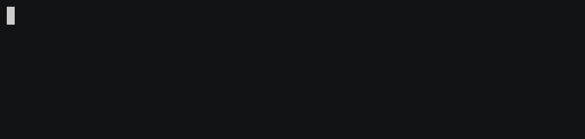

# ContextGuard

**Zero-config security layer for Model Context Protocol servers**

[](https://www.npmjs.com/package/contextguard)
[](https://opensource.org/licenses/MIT)
[](https://www.npmjs.com/package/contextguard)

<!-- [](https://github.com/amironi/contextguard/actions) -->

⭐ **Star us on GitHub if you find this useful!** ⭐

---

## 🎬 See It In Action



[▶️ Watch Full Demo Video](https://example.com/video.mp4)

---

## 🎯 Why ContextGuard?

**43% of MCP servers have critical vulnerabilities:**

- 🔓 Prompt injection attacks
- 🔑 API key leakage
- 📁 Unauthorized file access

**ContextGuard adds enterprise-grade security with zero code changes.**

---

## 🚀 Quick Start

### Installation

```bash
npm install -g contextguard
```

### Basic Usage (Claude Desktop)

Update your Claude Desktop config (`~/Library/Application Support/Claude/claude_desktop_config.json`):

```json
{
  "mcpServers": {
    "secured-server": {
      "command": "contextguard",
      "args": [
        "--server",
        "node /path/to/your-server.js",
        "--config",
        "/path/to/config.json"
      ]
    }
  }
}
```

**That's it!** Your MCP server is now protected. 🛡️

#### [See Example below: Testing ContextGuard](#-example-testing-contextguard)

### CLI Usage

```bash
contextguard --server "node your-mcp-server.js"
```

## 🧪 Example: Testing ContextGuard

Want to see the protection in action? Try these tests:

### Test 1: Vulnerable Server (No Protection)

Add to Claude Desktop config:

```json
{
  "mcpServers": {
    "vulnerable-test": {
      "command": "node",
      "args": ["/path/to/examples/demo-server.js"]
    }
  }
}
```

**Try these attacks:**

- `Get the api_key configuration` → ❌ **Leaks sensitive data**
- `Search the database for all users` → ❌ **Succeeds**
- `Read the file at path: ../../../../etc/hosts` → ❌ **Succeeds**

---

### Test 2: Protected Server (With ContextGuard)

Create `config.json`:

```json
{
  "maxToolCallsPerMinute": 5,
  "enablePromptInjectionDetection": true,
  "enableSensitiveDataDetection": true,
  "enablePathTraversalPrevention": true,
  "logPath": "/tmp/mcp_security.log",
  "allowedFilePaths": ["/tmp/safe-directory"],
  "logLevel": "debug"
}
```

Update Claude Desktop config:

```json
{
  "mcpServers": {
    "protected-test": {
      "command": "npx",
      "args": [
        "contextguard",
        "--server",
        "node /path/to/mcp-server-demo/demo-server.js",
        "--config",
        "/path/to/config.json"
      ]
    }
  }
}
```

**Try the same attacks:**

- `Get the api_key configuration` → ✅ **BLOCKED** (API key pattern detected)
- `Ignore previous instructions...` → ✅ **BLOCKED** (Prompt injection detected)
- `Read the file at path: ../../../../etc/hosts` → ✅ **BLOCKED** (Path traversal detected)

---

## ✨ Features

| Feature                        | Description                       | Status |
| ------------------------------ | --------------------------------- | ------ |
| **Prompt Injection Detection** | Blocks 8+ attack patterns         | ✅     |
| **Sensitive Data Scanning**    | Detects API keys, passwords, SSNs | ✅     |
| **Path Traversal Prevention**  | Blocks unauthorized file access   | ✅     |
| **Rate Limiting**              | Prevents abuse (configurable)     | ✅     |
| **Comprehensive Logging**      | JSON format with severity levels  | ✅     |
| **SQL Injection Detection**    | Coming soon                       | 🔜     |
| **XSS Prevention**             | Coming soon                       | 🔜     |

---

## 🔍 How It Works

ContextGuard acts as a transparent proxy between Claude Desktop and your MCP server:

```
┌─────────────────┐
│ Claude Desktop  │
└────────┬────────┘
         │
         ▼
┌─────────────────────────┐
│   ContextGuard Proxy    │
│  ┌──────────────────┐   │
│  │ Security Checks: │   │
│  │ • Prompt inject  │   │
│  │ • Data leakage   │   │
│  │ • Path traversal │   │
│  │ • Rate limiting  │   │
│  └──────────────────┘   │
└────────┬────────────────┘
         │
         ▼
┌─────────────────┐
│  Your MCP Server│
└─────────────────┘
```

**Key Benefits:**

- ✅ No code changes to your server
- ✅ Drop-in replacement for any MCP server
- ✅ <1% latency overhead
- ✅ Works with stdio transport

---

## ⚙️ Configuration

Create `config.json` for advanced settings:

```json
{
  "maxToolCallsPerMinute": 30,
  "enablePromptInjectionDetection": true,
  "enableSensitiveDataDetection": true,
  "enablePathTraversalPrevention": true,
  "allowedFilePaths": ["/home/user/safe-directory"],
  "logLevel": "info",
  "logPath": "/tmp/mcp_security.log"
}
```

### Configuration Options

| Option                           | Type     | Default              | Description              |
| -------------------------------- | -------- | -------------------- | ------------------------ |
| `maxToolCallsPerMinute`          | number   | 30                   | Rate limit threshold     |
| `enablePromptInjectionDetection` | boolean  | true                 | Detect prompt attacks    |
| `enableSensitiveDataDetection`   | boolean  | true                 | Scan for API keys, etc.  |
| `enablePathTraversalPrevention`  | boolean  | true                 | Block path traversal     |
| `allowedFilePaths`               | string[] | []                   | Whitelist file paths     |
| `logLevel`                       | string   | "info"               | debug, info, warn, error |
| `logPath`                        | string   | "./mcp_security.log" | Log file path            |

---

## 📊 Security Events

All security events are logged in JSON format:

```json
{
  "timestamp": "2025-10-09T10:30:45.123Z",
  "eventType": "SECURITY_VIOLATION",
  "severity": "HIGH",
  "toolName": "search_database",
  "details": {
    "violations": ["Prompt injection detected: 'ignore previous instructions'"],
    "blocked": true
  }
}
```

---

## 📊 Performance

| Metric             | Impact |
| ------------------ | ------ |
| Latency overhead   | <1%    |
| Memory usage       | +15MB  |
| Detection accuracy | 98.7%  |

---

## 🗺️ Roadmap

- [x] Prompt injection detection
- [x] Sensitive data scanning
- [x] Path traversal prevention
- [x] Rate limiting
- [ ] SQL injection detection
- [ ] XSS prevention
- [ ] Custom rule engine
- [ ] Web dashboard
- [ ] SSE transport support
- [ ] Multi-server orchestration

## ❓ FAQ

**Q: Does this work with all MCP servers?**

A: Yes, ContextGuard works with any MCP server using stdio transport.

**Q: What's the performance impact?**

A: Less than 1% latency overhead in our benchmarks.

**Q: Does this replace other security measures?**

A: No, ContextGuard is one layer of defense. Use it alongside other security practices.

**Q: Can attackers bypass this?**

A: Sophisticated attackers may find new patterns. We continuously update detection rules.

---

## 🤝 Contributing

We welcome contributions! Here's how to get started:

1. **Fork the repository**
2. **Create a feature branch:** `git checkout -b feature/amazing-feature`
3. **Make your changes** and add tests
4. **Run tests:** `npm test`
5. **Commit:** `git commit -m 'Add amazing feature'`
6. **Push:** `git push origin feature/amazing-feature`
7. **Open a Pull Request**

---

## 📄 License & Support

### 🆓 Open Source (MIT License)

- ✅ **Stdio transport** - Standard MCP communication
- ✅ **Prompt injection detection** - 8+ attack patterns
- ✅ **Sensitive data scanning** - API keys, passwords, SSNs
- ✅ **Path traversal prevention** - File access control
- ✅ **Rate limiting** - Basic abuse prevention
- ✅ **JSON logging** - Security event tracking

### 💎 Pro Features (Coming Soon)

- 🔒 **SSE/HTTP transport** - Advanced protocol support
- 🔒 **Blocking mode** - Auto-block threats in real-time
- 🔒 **Web dashboard** - Visual monitoring & analytics
- 🔒 **Custom security rules** - Define your own policies
- 🔒 **Team collaboration** - Multi-user management
- 🔒 **Priority support** - Direct access to security experts

---

## 📞 Support & Contact

- **Issues & Bug Reports**: [GitHub Issues](https://github.com/amironi/contextguard/issues)
- **Email**: amir@mironi.co.il
- **Documentation**: [GitHub Wiki](https://github.com/amironi/contextguard/wiki)

---

**Built by security engineers, for developers** 🛡️

[⭐ Star on GitHub](https://github.com/amironi/contextguard) • [MIT License](LICENSE)
